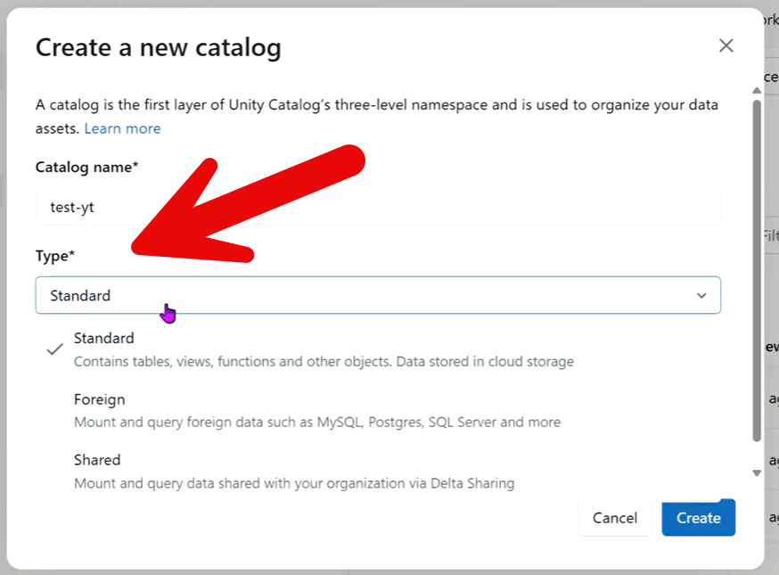

**EXPLANATION 01.3**

**Catalog Type**

The **“Catalog Type”** in Unity Catalog refers to **how and where the data in the catalog is stored and managed**.

When you create a catalog, you’re not just naming a container—you’re also defining **who manages the data and its storage location**.

Here’s the key idea:

**1. Managed Catalog (Databricks-managed)**

- Databricks controls the storage location

- Data is stored in a default location configured in the metastore

- Easier to set up and maintain

- Best for most users who want simplicity

**2. External Catalog (Customer-managed storage)**

- You specify the storage location (e.g., AWS S3, Azure Data Lake, GCS)

- You manage the underlying data files

- Gives more control over storage, compliance, and integration

- Often used in enterprise environments

**Why this matters:**  
The catalog type determines:

- Who controls the data (you vs. Databricks)

- Where the data physically lives

- How governance and access policies are applied

**In simple terms:**  
“Catalog Type” = **Who manages the data + where it is stored**

------------------------------------------------------------------------

**References Material**

Here are some useful YouTube videos specifically about **Unity Catalog Catalog Types, Managed vs External Catalogs, and Catalog setup in Databricks**:

1.  **Catalog, External Location & Storage Credentials in Unity Catalog**  
    Good explanation of managed vs external concepts and how catalog storage works in Databricks.  
    ▶️ [Watch Video](https://www.youtube.com/playlist?list=PL2IsFZBGM_IGiAvVZWAEKX8gg1ItnxEEb&utm_source=chatgpt.com)

2.  **Databricks Unity Catalog: Catalogs and Schemas**  
    Focuses on catalog hierarchy, schemas, and how catalogs are organized in Unity Catalog.  
    ▶️ [Watch Video](https://www.youtube.com/playlist?list=PL6pAXQQpiH-mi8AO5_UDPpOPPjted9kCv&utm_source=chatgpt.com)

3.  **Create Unity Catalog in Databricks \| Step-by-Step Tutorial**  
    Shows how to create catalogs and explains governance and storage configuration.  
    ▶️ [Watch Video](https://www.youtube.com/watch?v=2JefJx3yPf4&utm_source=chatgpt.com)

4.  **Unity Catalog Tutorial For Data Engineering Beginners**  
    Long-form deep dive covering catalogs, schemas, tables, storage credentials, and access control.  
    ▶️ [Watch Full Tutorial](https://www.youtube.com/watch?v=GJa4YH4j-ic&utm_source=chatgpt.com)

5.  **Databricks Unity Catalog Explained**  
    Explains the purpose of catalogs, governance, and Unity Catalog architecture in simpler terms.  
    ▶️ [Watch Overview](https://www.youtube.com/watch?v=EcYMO3uiB8A&utm_source=chatgpt.com)

The most relevant one for your exact topic (“Catalog Type”) is probably:

- **Video 1** for managed vs external storage

- **Video 2** for understanding catalog hierarchy and structure.
