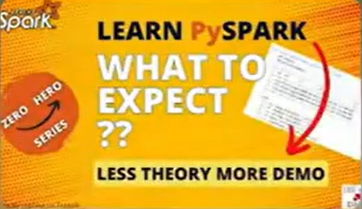

# **01 Databricks Tutorial 2025**

This introduction video launches a new **“Databricks 0 to Hero”** series
focused on learning the Databricks platform from beginner to advanced
concepts.

**Topics Covered in the Series**

The series plans to teach:

- **Databricks Architecture**

  - Understanding what Databricks is

  - How the platform is designed

- **Setting Up Databricks on Azure**

  - Environment configuration

  - Azure integration

- **Lakehouse & Unity Catalog**

  - Data Lakehouse concepts

  - Governance with Unity Catalog

- **Data Engineering Features**

  - Notebooks

  - Delta Live Tables (DLT)

  - Jobs & Workflows

  - Auto Loader

- **Data Analytics Features**

  - SQL Warehouses

  - Queries

  - Dashboards

- **DevOps & CI/CD**

  - Git integration

  - Azure DevOps

  - Databricks CLI & APIs

- **Serverless Computing**

  - Serverless offerings in Databricks

  - Benefits of serverless architecture

- **Cost Optimization**

  - Cost analysis

  - Platform optimization strategies

**What Learners Will Gain**

By the end of the series, learners should:

- Understand the major Databricks tools and services

- Gain practical knowledge of the platform

- Be prepared to attempt the Databricks Data Engineering Associate
  Certification

**Prerequisites**

The instructor recommends having basic knowledge of:

- Apache Spark

- PySpark

- Spark Streaming

- SQL

- Python

**Recommended Learning Resources**

The instructor suggests using the **“Ease with Data”** YouTube channel
for prerequisite learning, especially:

- **PySpark 0 to Hero**

>  style="width:2.50013in;height:1.46535in" />

- **Spark Streaming with PySpark**

These playlists cover topics from beginner concepts to advanced
optimization techniques.

* [Content](./../../README.md)
