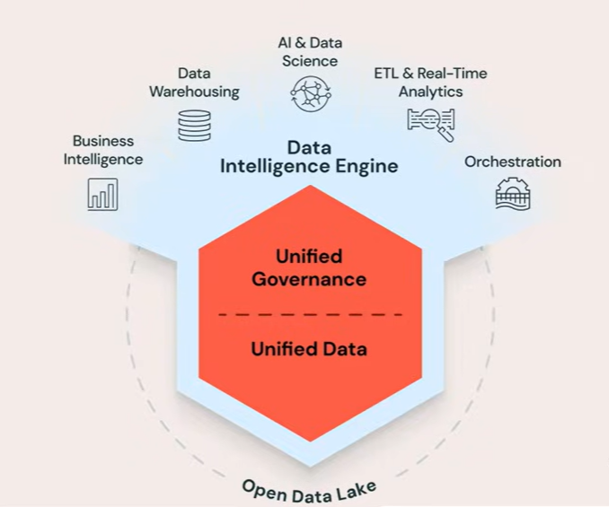
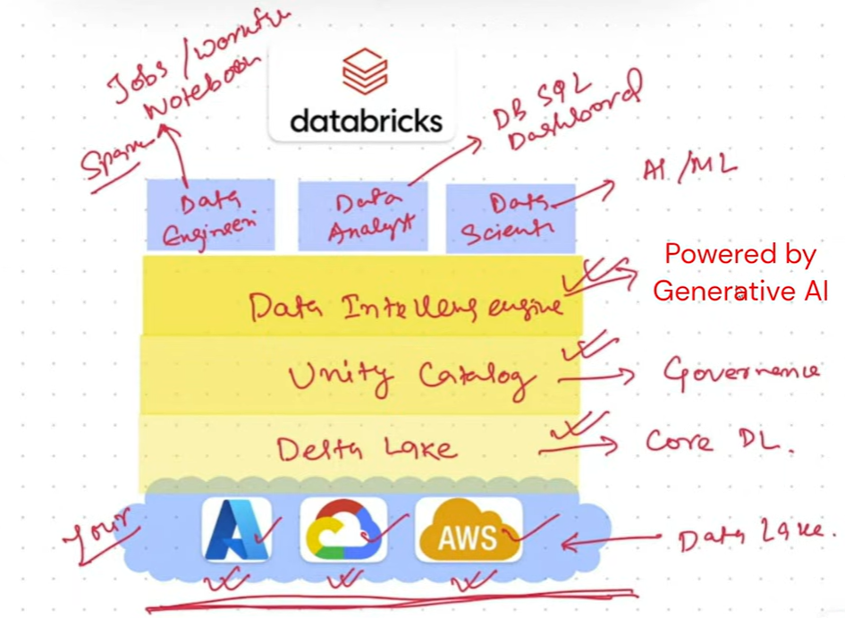

# 02 What is Data Lakehouse

**What is a Data Lakehouse?**

A **Data Lakehouse** is a modern data architecture that combines the benefits of:

- Data Lakes (cheap, scalable storage for raw data)

- Data Warehouses (fast analytics, ACID transactions, BI support)

Databricks built its platform around this concept and powers it using **Delta Lake**.

------------------------------------------------------------------------

**Main Problems in Traditional Data Platforms**

Traditional enterprise data platforms **often use many separate tools**:

- ETL tools

- Data warehouses

- Spark processing tools

- AI/ML platforms

- BI dashboards

- Orchestration tools

- Governance/security systems

This creates several challenges:

**1. Too Many Separate Tools**

Each system **must integrate correctly** with every other system.

Problems include:

- Complex integrations

- Security risks

- Data inconsistencies

- Higher maintenance costs

**Databricks Solution**

Databricks provides a **unified platform** where:

- engineering

- analytics

- AI/ML

- governance

- orchestration

all work together in one ecosystem.

------------------------------------------------------------------------

**2. Vendor Lock-In Problem**

Many traditional warehouses store data in **proprietary formats**.

This means:

- your data depends on a specific vendor

- you cannot easily move your data elsewhere

- you must use their engine to read your own data

------------------------------------------------------------------------

**Databricks/Open Format Approach**

Databricks **avoids vendor lock-in** by storing data in:

- Parquet

- CSV

- Avro

- ORC

- other open formats

Data stays in your cloud storage:

- AWS

- Azure

- GCP

Delta Lake sits on top of the data and provides advanced functionality.

Because formats are open:

- you always own your data

- you can move to another platform anytime

------------------------------------------------------------------------

**3. Duplicate Data Problem**

Traditional systems usually separate:

- Data Lakes (for AI/ML and ETL)

- Data Warehouses (for BI/reporting)

This creates:

- multiple copies of the same data

- different owners of the same data

- synchronization problems

- higher storage costs

------------------------------------------------------------------------

**What Databricks Did: Data Lake + Warehouse = Lakehouse**

Databricks merged both systems into one architecture:

Data Lake + Data Warehouse = Data Lakehouse

Now:

- raw and analytical data can live together

- one copy of data serves many purposes

- AI/ML and BI use the same data source

------------------------------------------------------------------------

**Role of Delta Lake**

Delta Lake is the engine powering the Lakehouse.

It adds warehouse-like capabilities to cloud storage.

Benefits include:

- ACID transactions

- Data versioning

- Time travel

- Audit history

- Transaction logs

- Reliability

- Scalability

This gives cloud storage the power of a database system.

------------------------------------------------------------------------

**Databricks Lakehouse Architecture**

**Bottom Layer — Cloud Storage**

Data resides in:

- AWS

- Azure

- GCP

------------------------------------------------------------------------

**Middle Layer — Delta Lake**

Delta Lake provides:

- Lakehouse functionality

- Transaction support

- Reliability

- Open-source storage layer

------------------------------------------------------------------------

**Governance Layer — Unity Catalog**

Unity Catalog handles:

- security

- governance

- lineage

- metadata management

------------------------------------------------------------------------

**Intelligence Layer — Data Intelligence Engine**

Provides:

- AI-powered insights

- natural language capabilities

- enterprise intelligence

------------------------------------------------------------------------

**Top Layer — User Personas & Tools**

**Data Engineers**

Use:

- notebooks

- Spark jobs

- workflows

- pipelines

**Data Analysts**

Use:

- Databricks SQL

- dashboards

- BI tools

**Data Scientists**

Use:

- AI/ML tools

- model training

- experimentation

------------------------------------------------------------------------

**Key Idea of Databricks**

Databricks is called a **Data Intelligence Platform** because it combines:

Data Lakehouse + Generative AI

And:

Data Lakehouse = Data Lake + Data Warehouse

------------------------------------------------------------------------

**Final Takeaway**

A Data Lakehouse:

- combines the flexibility of a Data Lake

- with the reliability and analytics power of a Data Warehouse

- while keeping data in open cloud formats

Databricks uses:

- Delta Lake for the Lakehouse engine

- Unity Catalog for governance

- AI capabilities for data intelligence

All on a single unified platform.

# [README](./../../../README.md)
