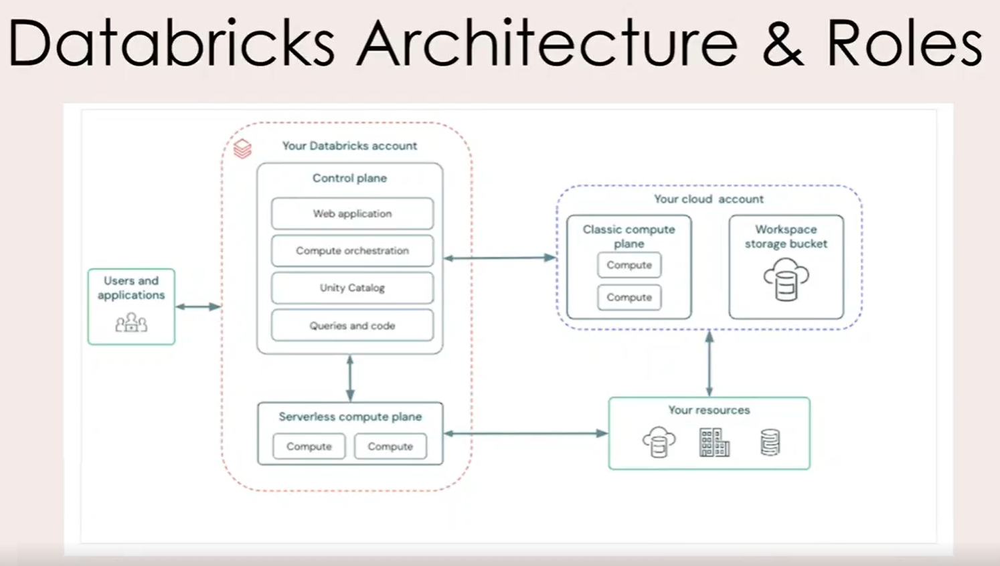

# 03 Databricks High Level Architecture

**Databricks High-Level Architecture**

**1. Databricks Runs on Cloud Providers**

Databricks can be deployed on:

- AWS

- Azure

- Google Cloud Platform (GCP)

------------------------------------------------------------------------

**2. Account and Workspace Structure**

- You first create a **Databricks Account**.

- An account can contain **multiple workspaces**.

<!-- -->

- **Creating and managing Metastores** (used by Unity Catalog to store metadata and governance information).

- **Assigning Metastores to different Workspaces** so those workspaces can access the same catalogs, schemas, and tables.

- **Managing Users and Groups** and granting them access to specific workspaces.

- **Managing Service Principals**, which are non-human identities used by applications, automation scripts, CI/CD pipelines, and jobs to securely access Databricks resources.

**Simple Example**

Databricks Account\
│\
├── Metastore\
│\
├── Workspace A (Dev)\
├── Workspace B (UAT)\
└── Workspace C (Prod)\
│\
├── Users\
├── Groups\
└── Service Principals

The Account Administrator can:

- Attach the same metastore to multiple workspaces.

- Give users access to specific workspaces.

- Create groups (e.g., Data Engineers, Analysts).

- Create service principals for automated jobs and applications.

------------------------------------------------------------------------

**3. Control Plane vs Data Plane**

This is the most important concept.

**Control Plane (Managed by Databricks)**

Stores and manages:

- Web application/UI

- Notebook configurations

- Cluster configurations

- Job configurations

- Logs and orchestration services

**Purpose:** Manage and orchestrate the platform.

------------------------------------------------------------------------

**Data Plane (Customer Cloud Account)**

Contains:

- Customer data

- Spark clusters

- Data processing workloads

Data always remains in the customer's cloud account and is processed there.

**Purpose:** Execute jobs and process data.

------------------------------------------------------------------------

**Architecture Diagram**

Databricks\
Control Plane\
(Configs, UI, Jobs, Logs)\
│\
▼\
Customer Cloud Account\
Data Plane\
(Data + Clusters + Compute)

The control plane manages operations, while the data plane stores and processes the customer's data.

------------------------------------------------------------------------

**4. Important Security Concept**

**Customer data does NOT move to the control plane.**

- Data stays in the customer's cloud account.

- Databricks manages configurations and orchestration.

- Processing happens in customer-owned clusters.

------------------------------------------------------------------------

**5. Databricks Roles**

**Account Administrator**

Responsible for:

- Creating workspaces

- Managing users

- Managing metastores

- Assigning permissions across workspaces

------------------------------------------------------------------------

**Metastore Administrator**

Responsible for:

- Creating catalogs

- Managing data objects

- Delegating privileges

------------------------------------------------------------------------

**Workspace Administrator**

Responsible for:

- Managing a specific workspace

- Managing workspace users

- Managing workspace assets and permissions

------------------------------------------------------------------------

**Owner**

The creator of an object such as:

- Table

- Schema

- Notebook

The owner can delegate permissions to other users.

**Interview-Ready Summary**

Databricks architecture consists of a **Control Plane** and a **Data Plane**. The Control Plane, managed by Databricks, handles workspace management, notebooks, cluster configurations, jobs, and orchestration. The Data Plane resides in the customer's cloud account and contains the actual data and compute clusters. Databricks supports multiple workspaces under a single account and provides four key administrative roles: Account Administrator, Metastore Administrator, Workspace Administrator, and Owner.

At the Databricks Account level, administrators manage metastores, users, groups, service principals, and workspace assignments. A metastore can be attached to multiple workspaces, enabling centralized governance through Unity Catalog, while users, groups, and service principals are granted access to workspaces based on organizational requirements.

# [README](./../../../README.md)
