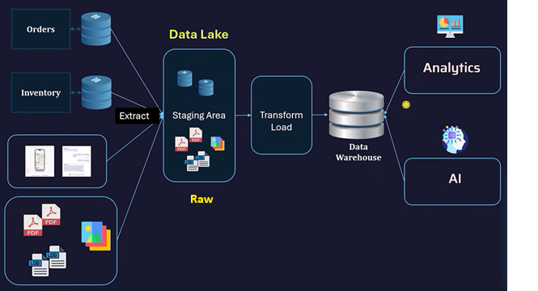
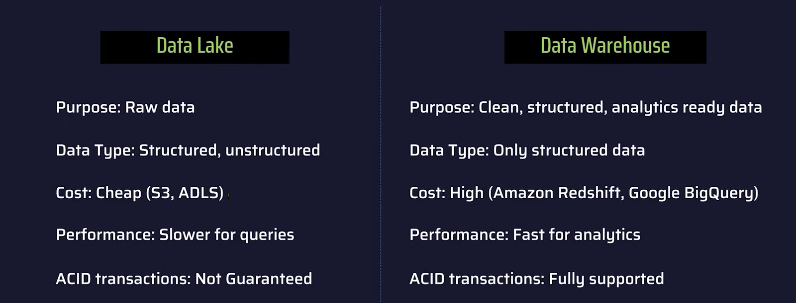

# EXPLANATION_01_1

**Data Lakehouse \| Data Lakes \| Data Warehouses**

A key advantage of a **Data Lakehouse** is that it merges the strengths of two older systems: **data lakes** and **data warehouses**.

- **Data lakes** are great for storing massive amounts of raw data (structured, semi-structured, and unstructured) at low cost and high scalability. But they often lack strong data management, consistency, and performance for analytics.

- **Data warehouses** provide clean, structured data with strong governance, reliability, and fast query performance—but they can be expensive and less flexible when handling large or varied data types.

A **Data Lakehouse combines both**:

- It keeps the **scalability and flexibility** of data lakes, allowing you to store huge volumes of diverse data.

- At the same time, it adds **reliability features** like data consistency, schema enforcement, and optimized query performance—similar to data warehouses.

**In simple terms:**  
You get the ability to store *any kind of data at scale* (like a data lake) while still being able to *analyze it efficiently and reliably* (like a data warehouse).

- 

------------------------------------------------------------------------

**References Material**

Here are some good YouTube videos that explain **Data Lakehouse** concepts clearly:

- **[Data Lakehouses Explained](https://www.youtube.com/watch?v=Enu-EH7RHHM) \| [IBM Technology](https://www.youtube.com/@IBMTechnology) \|** YouTube

- [Data Warehouse vs Data Lake vs Data Lakehouse \| ETL, OLAP vs OLTP](https://www.youtube.com/watch?v=yRerKDM1h74) \| [  
  codebasics](https://www.youtube.com/@codebasics) \| YouTube

  # [README](./../../../README.md)
